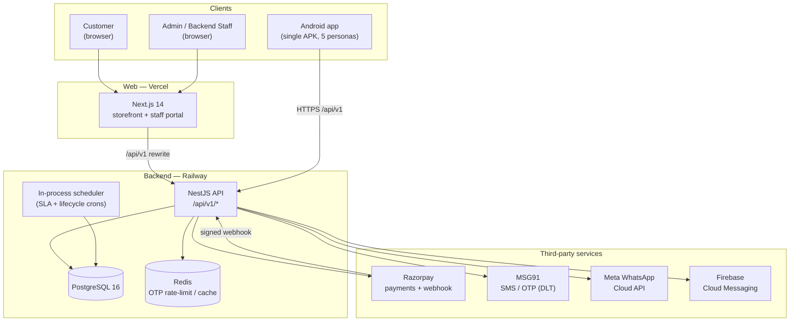
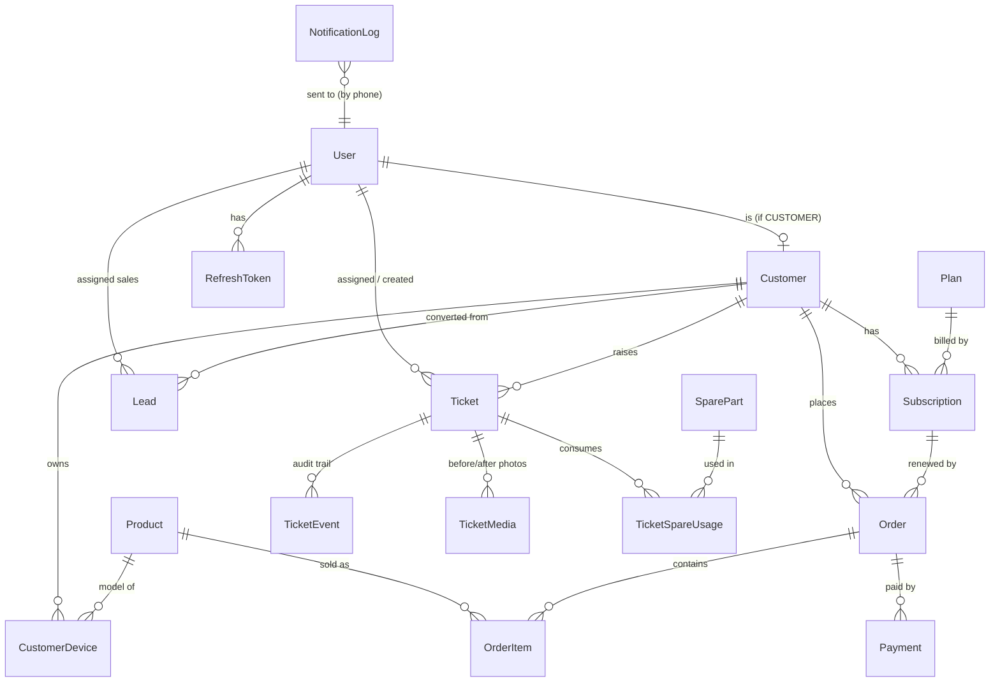
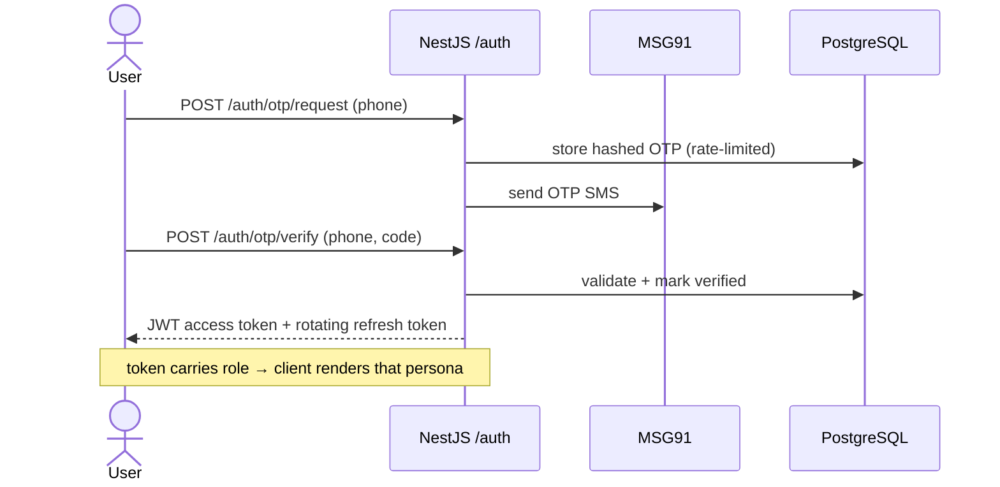
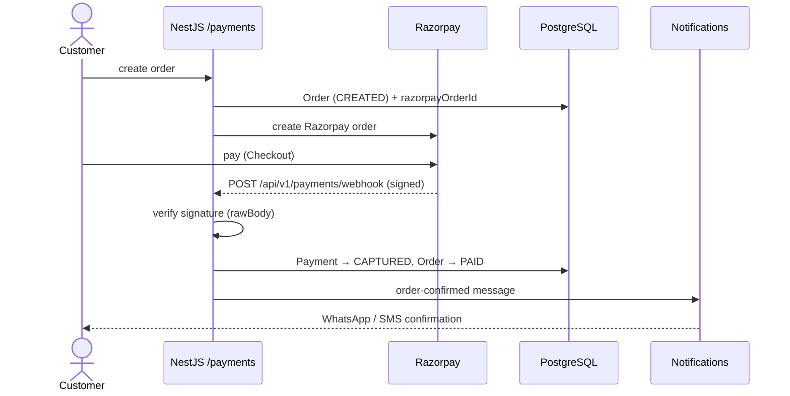
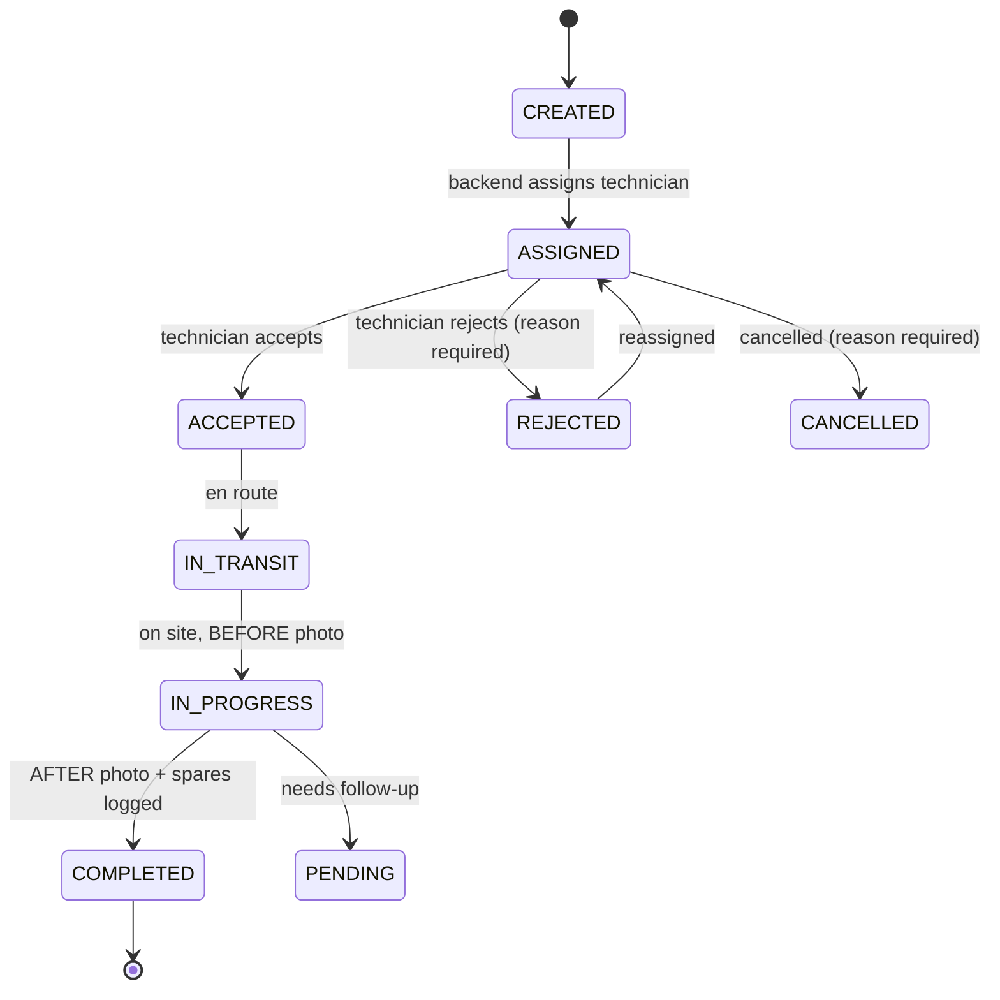

# Anthar Works — Water Purifier Subscription & Service Platform

Anthar Works is a dual-channel platform for a water-purifier subscription and service business.
A **Next.js web app** (public storefront + staff portal) and a **single Android app** both talk to
one **NestJS API** backed by a shared **PostgreSQL** database. Five personas — **Customer, Admin,
Backend Staff, Field Technician, Sales Executive** — work off that one database; a user's role,
decided at OTP login, determines what they see. The platform covers the full lifecycle: browsing and
buying purifiers, subscriptions and renewals, Razorpay payments, field service tickets with
geotagged before/after photos and SLA tracking, sales-lead capture, and customer messaging over
WhatsApp / SMS / push.

> **New here?** Read this file top-to-bottom and you'll understand the whole system. Deeper detail
> lives in [`docs/DEVELOPMENT_PLAN.md`](docs/DEVELOPMENT_PLAN.md) and the [FRD](docs/FRD.pdf).

## The three apps

| App | Path | What it is | Personas |
|---|---|---|---|
| **Web** | `web/` | Next.js 14 (App Router). Public e-commerce storefront **and** the authenticated staff portal. | Customer (storefront) · Admin / Backend (portal) |
| **Android** | `android/` | Single Kotlin / Jetpack Compose APK. Persona is chosen by the user's role at OTP login — one build serves everyone. | Customer · Technician · Sales · Admin / Backend |
| **Backend** | `backend/` | NestJS 10 API (global prefix `/api/v1`), Prisma ORM, PostgreSQL 16, Redis. All business logic, integrations, and scheduled jobs. | — (serves all clients) |

## System architecture



The web app never holds business logic for the API: `web/next.config.mjs` rewrites every
`/api/v1/*` request to the backend (`API_URL`), so the browser and the Android app hit the **same**
endpoints. The backend is a single always-on process — its cron jobs run **in-process**, so it must
run as exactly **one replica** (two copies would double every scheduled message).

## Backend modules

NestJS modules under `backend/src` (route prefixes are relative to the global `/api/v1`):

| Module | Routes | Responsibility |
|---|---|---|
| `auth` | `/auth` | OTP request/verify, JWT issue, rotating refresh tokens, logout |
| `users` | `/users` | Staff/user management and roles |
| `customers` | `/customers` | Customer master, addresses, devices, search |
| `catalog` | `/products`, `/plans` | Product catalog and subscription plans (incl. custom plans) |
| `payments` | `/orders`, `/me`, `/payments/webhook` | Order creation, customer self-service (`/me`), Razorpay order + **signature-verified webhook** |
| `tickets` | `/tickets`, `/tickets/:id/media`, spares | Service-ticket state machine, geotagged media, spare-part usage, **hourly SLA-alert cron** |
| `leads` | `/leads` | Sales-lead capture (app tap / sales temp-id / referral / buy-back) → customer conversion |
| `allocations` | `/allocations` | Map customers/technicians to backend staff by pincode or product |
| `notifications` | `/notifications` | WhatsApp/SMS/push dispatch, `notifications_log`, **daily lifecycle crons** |
| `dashboard` | `/dashboard` | Aggregated operations stats for the portal/app home |
| `reports` | `/reports` | Reporting queries |
| `health` | `/health` | Uptime/liveness check |
| `prisma` | — | Shared Prisma client (database access) |

`backend/src/main.ts` enables `rawBody` (needed to verify Razorpay webhook signatures), a global
validation pipe (`whitelist: true, transform: true`), and CORS.

## Data model

One PostgreSQL database, defined in [`backend/prisma/schema.prisma`](backend/prisma/schema.prisma).
Core entities and relationships:



**Key enums:**

- **Role:** `ADMIN · BACKEND · TECHNICIAN · SALES · CUSTOMER` — the persona system.
- **TicketStatus:** `CREATED → ASSIGNED → ACCEPTED/REJECTED → IN_TRANSIT → IN_PROGRESS → COMPLETED | PENDING | CANCELLED` (state machine enforced in `TicketsService`).
- **OrderStatus:** `CREATED · PAID · FAILED · DELIVERED · CANCELLED` · **PaymentStatus:** `PENDING · CAPTURED · FAILED · REFUNDED` (only ever set from verified webhooks).
- **SubscriptionStatus:** `ACTIVE · INACTIVE · STOPPED` · **LeadStatus:** `NEW · CONTACTED · CONVERTED · LOST`.

## Core flows

### OTP login (every persona)



Refresh tokens are **single-use**: presenting one revokes it and issues a fresh pair, so a stolen
refresh token is detectable. The web client (`web/lib/api.ts`) handles the 401 → refresh → retry loop.

### Order → payment



### Ticket lifecycle (field service)



Photos are **camera-only and geotagged** (the app blocks the gallery; the server requires GPS
coordinates on each `TicketMedia`). An hourly SLA cron (`tickets/sla-alerts.service.ts`) flags
tickets nearing or past `slaDueAt`; daily lifecycle crons (`notifications/lifecycle-crons.service.ts`,
03:30 UTC) send renewal reminders, warranty-expiry notices, and installation-day FAQ videos — each
deduped against `notifications_log` so reruns are safe.

## Tech stack at a glance

- **API:** NestJS 10, Prisma, PostgreSQL 16, Redis 7
- **Web:** Next.js 14 (App Router, `output: standalone`), Tailwind CSS, hand-rolled components
- **Android:** Kotlin, Jetpack Compose + Material 3, Navigation Compose, Retrofit/OkHttp, CameraX, Play Services Location; FCM + Razorpay Checkout planned
- **Integrations:** Razorpay (payments), Meta WhatsApp Cloud API, MSG91 (SMS/OTP, DLT-registered), Firebase Cloud Messaging (push)
- **Storage:** S3-compatible object storage for geo-tagged job photos (MinIO locally)

## Repository layout

| Path | What it is |
|---|---|
| `backend/` | NestJS + TypeScript API server |
| `backend/src/` | Feature modules (auth, payments, tickets, notifications, …) |
| `backend/prisma/schema.prisma` | The single source of truth for the data model |
| `web/` | Next.js storefront + staff portal |
| `web/app/` | App Router pages — storefront at the root, staff portal under `web/app/portal/` |
| `web/lib/api.ts` | API client: bearer token, refresh-rotation, 401 retry |
| `android/` | Single Kotlin/Compose app; persona decided by role at login |
| `android/app/src/main/` | Screens, `data/Api.kt` (Retrofit), `Persona.kt`, `AndroidManifest.xml` |
| `docs/` | Development plan, deployment guides, FRD |

## Local development

```bash
# 1. Infrastructure (Postgres, Redis, MinIO)
docker compose up -d

# 2. Backend API
cd backend
cp .env.example .env
npm install
npx prisma migrate dev
npm run start:dev          # http://localhost:3001/api/v1

# 3. Web (storefront + staff portal)
cd web
npm install
npm run dev                # http://localhost:3000

# 4. Android — open /android in Android Studio
#    (defaults to http://10.0.2.2:3001/api/v1/ for the emulator)
```

## Environment variables

The backend reads everything from its `.env` — see [`backend/.env.example`](backend/.env.example)
for the full list with comments. Grouped:

| Group | Variables |
|---|---|
| Database / cache | `DATABASE_URL`, `REDIS_URL` |
| Auth / OTP | `JWT_ACCESS_SECRET`, `JWT_REFRESH_SECRET`, `JWT_ACCESS_TTL`, `JWT_REFRESH_TTL`, `OTP_TTL_SECONDS`, `OTP_MAX_ATTEMPTS`, `SUPER_ADMIN_EMAILS` |
| Razorpay | `RAZORPAY_KEY_ID`, `RAZORPAY_KEY_SECRET`, `RAZORPAY_WEBHOOK_SECRET` |
| MSG91 (SMS) | `MSG91_AUTH_KEY`, `MSG91_SENDER_ID`, `MSG91_OTP_TEMPLATE_ID` |
| WhatsApp | `WHATSAPP_PHONE_NUMBER_ID`, `WHATSAPP_ACCESS_TOKEN`, `WHATSAPP_COMPANY_RECIPIENT` |
| Push | `FCM_SERVICE_ACCOUNT_JSON` |
| Object storage | `S3_ENDPOINT`, `S3_ACCESS_KEY`, `S3_SECRET_KEY`, `S3_BUCKET` |
| Content | `FAQ_VIDEO_URL` |
| Feature-flag defaults | `PAYMENTS_ENABLED`, `WHATSAPP_ENABLED`, `SMS_ENABLED` |

**Admin feature toggles.** Online payments, WhatsApp, and SMS each have an on/off switch in
**Portal → Settings** (ADMIN only), backed by the `AppConfig` table. The `*_ENABLED` env vars only
set the initial default; admins flip them live afterwards. When a channel is off, matching messages
are recorded in `notifications_log` as `SUPPRESSED` instead of sent — except **login OTP, which
always sends over SMS** so sign-in keeps working.

Without provider keys the system still runs: messages are logged to the console and
`notifications_log` instead of being sent (dev/test mode). Razorpay keys are **optional to boot**:
without them (or with the payments toggle off) the storefront takes orders offline and staff mark
them paid — add the keys and flip the toggle on to accept online payments. The web app needs only
`API_URL` (the backend's public URL).

## Deployment

Two routes are documented — pick one:

- **[Beginner guide (Vercel + Railway)](docs/DEPLOYMENT_FOR_BEGINNERS.md)** — a click-through
  walkthrough with no server/SSH/Docker knowledge required. Web on Vercel, backend + Postgres + Redis
  on Railway.
- **[Technical reference (DEPLOYMENT.md)](docs/DEPLOYMENT.md)** — self-hosted Docker Compose on a
  single VM behind a TLS reverse proxy, plus Android release and operations notes.

## Further reading

- 📄 [Development plan](docs/DEVELOPMENT_PLAN.md) — phased build plan and architecture rationale
- 📄 [Feature Requirements (FRD)](docs/FRD.pdf) — the product spec
